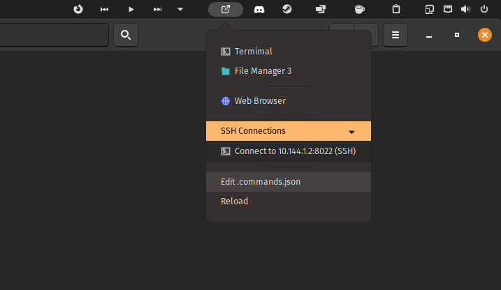

### Command Menu for GNOME Top Bar

[][ego] 

[ego]: https://extensions.gnome.org/extension/4850/command-menu/

GNOME shell extension to manage command shortcuts in the GNOME Top Bar.

Inspired by Shuttle and SSHMenu.



For Icon Names - https://specifications.freedesktop.org/icon-naming-spec/latest/ar01s04.html

---

#### Example ~/.commands.json

```
[
    {
        "title": "Termimal",
        "command": "gnome-terminal",
        "icon": "utilities-terminal"
    },
    {
        "title": "File Manager 3",
        "command": "nautilus",
        "icon": "folder"
    },
    {
        "type": "separator"
    },
    {
        "title": "Web Browser",
        "command": "firefox",
        "icon": "web-browser"
    },
    {
        "type": "separator"
    },
    {
        "title": "SSH Connections",
        "type": "submenu",
        "submenu": [
            {
                "title": "Connect to Server (SSH)",
                "command": "gnome-terminal -- bash -c 'ssh root@10.144.1.2 -p 8022'",
                "icon": "utilities-terminal"
            }
        ]
    }
]
```

---

#### Generate Build Zip

```
zip gnome-command-menu.zip icon.svg metadata.json extension.js README.md LICENSE
```

#### Manual Install

```
git clone https://github.com/arunk140/gnome-command-menu.git
cd gnome-command-menu
gnome-extensions package 
gnome-extensions install command-menu@arunk140.com.shell-extension.zip
```
